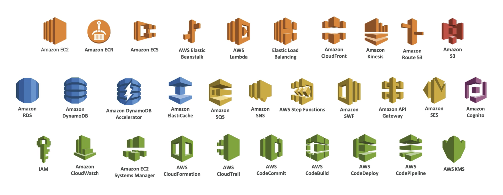

# Amazon Web Services

## Introduction

This is an repository to hold all the knowledge that I have related to AWS and taking some of it's certifications exam, mostly is a way for me to do a [[brain dump]] on certain topics, but also it's a way to share what I have, I use [Obsidian][0] as a knowledge management tool, so please keep in to account that I might have forgotten to include something into this repository, or that the formatting may be odd, so please create an issue (or a PR) to this repository so that I can review and fix any problem you might find.

## Foreword

This guide assumes you have some [basic concepts][1], please make sure that you review them first and make sure that you understand them first, there will a "high level" information as well as a "deep dive" on some concepts in case that you will like to have more details about some subjects.

## Repository Organization

This repository has a sub folder for each one of the main [[AWS]] services, with an special folder for [basic concepts][1], you can jump right into a folder, or you follow along from this index file, in any case, if you want to jump ahead, good luck, and may the force be with you :wink:.

## History

For reference, this is how [[AWS]] [history started][8]:

> In November 2004, the first AWS service launched for public usage: Simple Queue Service (SQS).[13] Thereafter Pinkham and lead developer Christopher Brown developed the Amazon EC2 service, with a team in Cape Town, South Africa.
>
> Amazon Web Services was officially re-launched on March 14, 2006, combining the three initial service offerings of Amazon S3 cloud storage, SQS, and EC2. The AWS platform finally provided an integrated suite of core online services, as Chris Pinkham and Benjamin Black had proposed back in 2003,

From 2006 to this part it has grown to be named as one of the "defacto" standards for cloud computing, until other competitors ([[GCP]], [[Azure]], [[Alibaba]], etc) appeared.

## [AWS Services][2]

Here's a small list of [[AWS]] that we will be reviewing in this repository:

[][2]

The actual list of [[AWS]] services is huge! They offer more than 175 and they are divided into several categories, so there's a problem, how and where do you start learning about the services?, there is some level of "dependencies" between the services as they are integrated, or built on top of each other, hence I will try to leverage that dependency links in this repository so that you can learn the [basic concepts][1] first, then learn the [[AWS]] [core concepts][3] and [services][4], and then follow along with the [rest of the services][5].

There's some information that doesn't fit anywhere but in this introduction thou :sweat_smile:, and it's the [[AWS]] [five pillar concept][6] that comes from their [Well Architected Framework][7]. Basically after 10 years of creating cloud solutions for very big customers with AWS services, they offer a guide of best practices to be followed, which consist of the following aspects of the infrastructure architecture:

1. Security
2. Performance Efficiency
3. Reliability
4. Operational Excellence
5. Cost Optimization

We will not dive too much on each particular subject as they can be really big, in turn they will be mentioned in each of the service on how to address each one of them.

## What's next

So, how do you continue navigating this repository? As a suggestion you can begin this journey at any of the following links, the suggested order is from top to bottom, there will be a "What's next" section in each page providing a path to follow:

- [basic concepts][1]
- [aws core concepts][3]
- [aws core services][4]
- [aws service list][5]

I really hope that this repository helps you :hugs:, have a safe journey navigating it! AWS services ahead :stuck_out_tongue_closed_eyes:

[0]: https://obsidian.md/
[1]: https://github.com/ggarcia24/basic_it_knowledge
[2]: https://aws.amazon.com/products/
[3]: aws_core_concepts.md
[4]: aws_core_services.md
[5]: aws_service_list.md
[7]: https://aws.amazon.com/getting-started/fundamentals-core-concepts/?e=gs2020&p=gsrc
[6]: https://aws.amazon.com/architecture/well-architected/?e=gs2020&p=fundcore
[8]: https://en.wikipedia.org/wiki/Amazon_Web_Services#History
