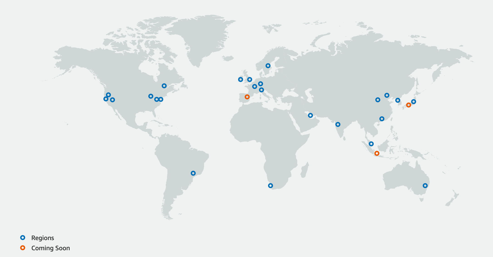

# AWS Core Concepts
[[AWS]] is a [Cloud Provider][0], that means that it offers many services to help different organizations with their [it infrastructure][1] or [processes][2].

This services are built inside [datacenters][3] connected by [computer network][4] it means that the services that you access in [[AWS]] will be bound to a certain location, because in the end this services require some [infrastructure][1] that needs to be [deployed][4][^1] and phisically "living" somewhere.

Services in [[AWS]] are offered depending on:
- Global availability: Service is available without restrictions across all [AWS Regions](#AWS-Regions)
- Regional availability: Service is available in an specific [AWS Regions](#AWS-Regions)
- Edge availability: Service is available in a specific location close to user network location

## AWS Regions
[[AWS]] calls region to a group of availability zones hosted in a geographical area. Availability zones (AZ for short) are isolated locations, meaning that are [datacenters][3] where the actual service is running. Some times you also have Local zones, which allows you to place resources in multiple locations close to your users.

Here's a list of the AWS Regions available in June 2020:

[][6]

Services and Resources **are not replicated across AWS Regions unless you specifically do it so** this means that if one of the AZ where your application is running has a failure, you application will run into failure, that's why [[AWS]] suggest that services that need to be [highly available][7] to be deployed in more than one (and at minimum 3) AZ.

For this types of changes, it usually means that you need to make changes and to addapt for that in your [application architecture][8], and apply some common [design patterns][9].

There's more information about this topic in the [Relational Database Service][10] (RDS for short) [user guide][11] that I suggest you to read in case you need more information.

# What's next
Head over to [aws core services][12]

[0]: basic_concepts/cloud/index.md
[1]: basic_concepts/infrastructure.md
[2]: basic_concepts/it_processes.md
[3]: basic_concepts/datacenters.md
[4]: basic_concepts/network/index.md
[5]: basic_concepts/deployment.md
[6]: https://aws.amazon.com/about-aws/global-infrastructure/
[7]: basic_concepts/high_availability.md
[8]: basic_concepts/architecture.md
[9]: basic_concepts/design_patterns.md
[10]: rds/index.md
[11]: https://docs.aws.amazon.com/AmazonRDS/latest/UserGuide/Concepts.RegionsAndAvailabilityZones.html
[12]: aws_core_services.md
[^1]: This deployments and infrastructure will be handled by [[AWS]], as part of their service offering, that means that a lot of the costs, and time required will be offloaded from the people using the service, hence being able to focus exclusively on the actual application/service that they are developing.
