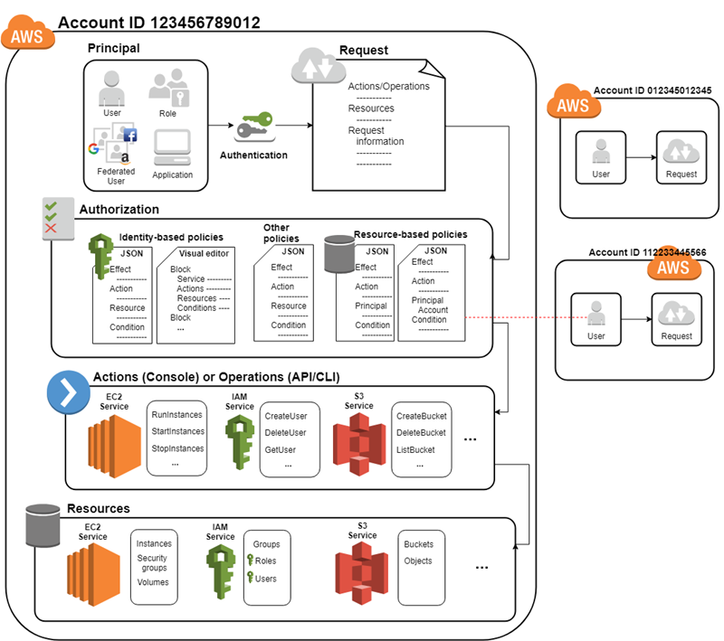
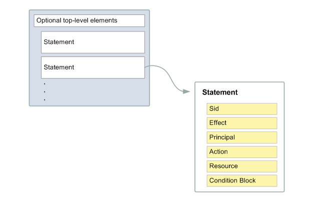

# Identity and Access Management

Reference:
* AWS Documentation: https://docs.aws.amazon.com/IAM/latest/UserGuide/intro-structure.html

## Introduction
IAM (for short), it's a global service, and it manages eveything related to authentication and authorization within AWS, this can be for user, groups or roles accessing AWS Services or Resources, as well as access between AWS Services sing other AWS Services resources.

* By default all request are denied, 
* You need to explicitly allow any permissions
* an explicit deny in any policy overrides any allows.
* The existence of an Organizations SCP, IAM permissions boundary, or a session policy overrides the allow. If one or more of these policy types exists, they must all allow the request. Otherwise, it is implicitly denied.
* If you need to make a request in a different account, a policy in the other account must allow you to access the resource and the IAM entity that you use to make the request must have an identity-based policy that allows the request.

## Terms:
* **Principals**: A principal is an entity (person or application) that can make a request for an action or operation on an AWS resource.
* **Actions or Operations**: Operations are defined by a service, and include things that you can do to a resource, such as viewing, creating, editing, and deleting that resource[^1].
* **Request**: Information related to the operation being attempted, includes (Action or Operation, Resources, Principal, Environment data, and Resource Data)
* **Resources**: Data related to the resource that is being requested. This can include information such as a DynamoDB table name or a tag on an Amazon EC2 instance.
* **Identities**: The IAM resource objects that are used to identify and group. You can attach a policy to an IAM identity. These include users, groups, and roles.

## How it Works:
Here's a diagram about how things are connected:



When an authenticated <u>principal</u> tryies to perform an <u>action</u> over a <u>resource</u> it send a <u>request</u> to AWS to authorize the request against all available policies.

[Policies are written in JSON][3] and they basic structure looks like:



They usually have this format:

```json
{
  "Version": "2012-10-17",
  "Statement": [
    {
      "Sid": "AllowAllS3ListOperations",
      "Effect": "Allow",
      "Action": [
	  	"s3:List*"
	  ],
      "Resource": "*"
    }
}
```

And there's a huge [library of examples that you can browse to see][1], but as you can see some fields support whild cards allowing to write flexible policies

## Main Features
* Centralized control of your AWS account permissions
* It's Integrated with [many AWS services][2]
* Offers granular permissions
* Has a set of Predefined "managed policies"
* Multi-Factor Authentication
* Identity Federation ([SAML], [Cognito])
* Provide temporary access for users/devices and services where necessary
* Set up password rotation policy
* Support PCI DSS compliance

## Security Best Practice
* **Never write, commit or share your IAM credentials**, store them securely
* **Don't ever use your root account**, create a new user as soon as you have logged in and configured all the suggested AWS security checks (MFA, etc)
* Give users the **least ammount of privileges** possible
* Create **ONE IAM user per Physical Person**
* Create **ONE IAM role per Application**
When you select policies for a user/group/role you can select specific policies or a jub function, which is a policy designed to closely align to a common job in the IT industry, ie: Database Administrator, Billing, Developer power-user, etc


## Notes
* For a role you have to set the permissions but also the service/users that are allowed to assume this role
* Power User Access allows access to all AWS services except the management of groups and users within IAM

[1]: https://docs.aws.amazon.com/IAM/latest/UserGuide/access_policies_examples.html
[2]: https://docs.aws.amazon.com/IAM/latest/UserGuide/reference_aws-services-that-work-with-iam.html
[3]: https://docs.aws.amazon.com/IAM/latest/UserGuide/access_policies.html#access_policies-json
[^1]: There's a list in https://docs.aws.amazon.com/IAM/latest/UserGuide/reference_policies_actions-resources-contextkeys.html of all the actions, resources and conditions that you can specify in a policy!